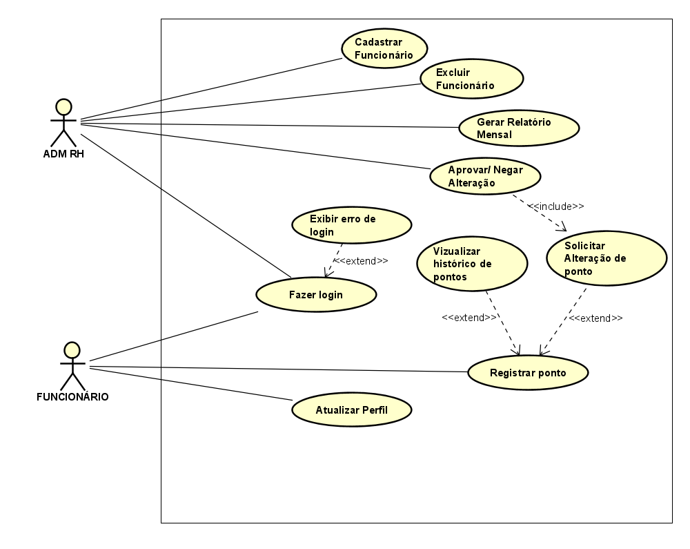
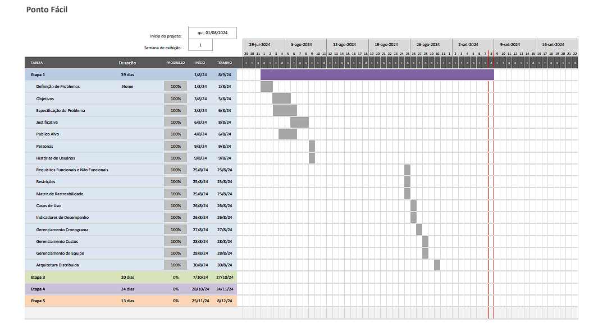
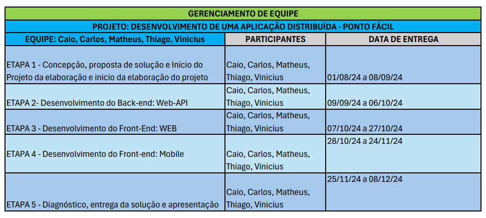
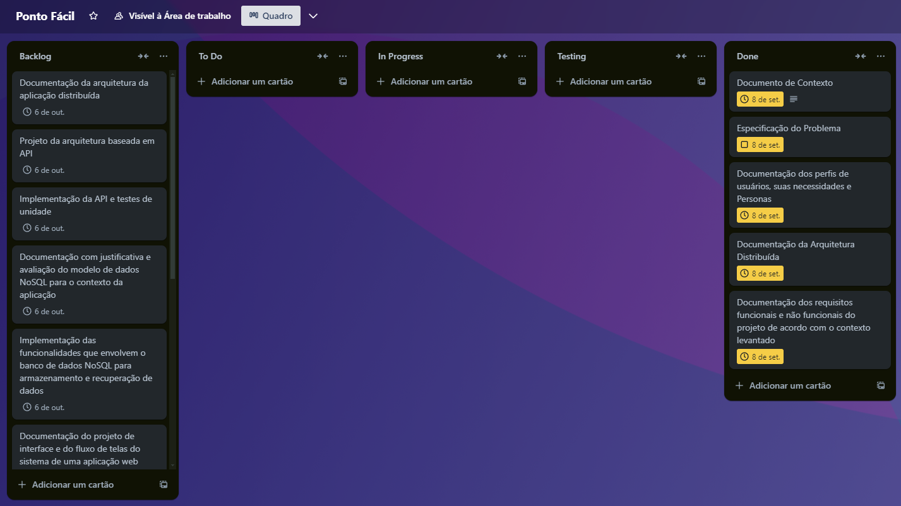

# Especificações do Projeto

O PontoFácil é um aplicativo de controle de ponto eletrônico para ajudar empresas a gerenciar a jornada de trabalho dos funcionários com rastreamento de horas trabalhadas, relatórios detalhados e gestão de equipes remotas.

## Personas

As personas levantadas durante o processo de entendimento do problema são apresentadas nas figuras que se seguem. 

### Gerência e Supervisão

| | João Almeida | Maria Oliveira |
|-|--------------|----------------|
| | 

 | 

 |
| Idade | 45 | 29 |
| Formação | Pós-graduação em Gestão de Recursos Humanos | Graduação em Administração de Empresas |
| Ocupação | Gerente de Recursos Humanos em uma empresa de médio porte | Supervisora de equipe em uma empresa de logística |
| Aplicativos | • Linkedin • Google Calendar • Microsoft Teams • Whatsapp • Instagram • Trello | • Linkedin • Google Calendar • Microsoft Teams • Whatsapp • Instagram • Trello |
| Motivações | João precisa de uma ferramenta eficiente para monitorar o ponto dos funcionários de sua empresa, garantindo que a conformidade com a legislação trabalhista seja mantida. Ele valoriza relatórios detalhados e a possibilidade de acessar rapidamente os registros de ponto para auditorias e tomada de decisões. | Maria precisa acompanhar a pontualidade e as horas extras de sua equipe, que trabalha em diferentes turnos. Ela busca uma ferramenta que permita verificar rapidamente as presenças e ausências dos funcionários, além de facilitar a aprovação de horas extras. |
| Frustrações | João fica frustrado quando sistemas de controle de ponto são complicados de usar ou não oferecem suporte adequado. Ele também se preocupa com a segurança dos dados dos funcionários e com a precisão das informações registradas. | Maria se irrita quando há atrasos na atualização dos registros de ponto ou quando o sistema é inacessível em momentos críticos. Ela também se preocupa com a dificuldade de monitorar as equipes que trabalham em locais remotos. |
| Hobbies | Ciclismo, leitura de livros sobre gestão, e viagens com a família. | Corrida, fotografia, e culinária. |

### Funcionário e Diretoria

| | Lucas Ferreira | Ana Costa |
|-|----------------|-----------|
| | 

 | 

 |
| Idade | 27 | 25 |
| Formação | Técnico em Edificações | MBA em Finanças |
| Ocupação | Funcionário de campo em uma empresa de construção civil | Diretora Financeira em uma startup |
| Aplicativos | • Google Maps • Spotify • Youtube | • Excel • Slack • Google Drive |
| Motivações | Lucas deseja um sistema de ponto fácil de usar diretamente no celular, que permita registrar sua entrada e saída do trabalho, mesmo quando está em diferentes locais de obra. Ele valoriza a simplicidade e rapidez no registro, além de querer acesso fácil às suas horas trabalhadas. | Ana precisa de uma ferramenta que ofereça relatórios precisos sobre o controle de ponto para que ela possa gerenciar a folha de pagamento e garantir que as horas extras estejam corretamente calculadas. Ela valoriza a possibilidade de acessar relatórios de qualquer lugar. |
| Frustrações | Lucas fica frustrado quando o sistema de controle de ponto é complicado ou quando há falhas na conexão que impedem o registro de ponto. Ele também se preocupa com a precisão dos registros para garantir que suas horas extras sejam contabilizadas corretamente. | Ana se frustra com sistemas que não oferecem relatórios personalizados ou que não permitem uma fácil exportação dos dados para análise financeira. Ela também se preocupa com a segurança e privacidade dos dados financeiros e dos funcionários. |
| Hobbies | Pesca, assistir a esportes, e jogar videogame. | Yoga, leitura de economia, e participação em workshops de finanças. |

## Histórias de Usuários

A partir da compreensão do dia a dia das personas identificadas para o projeto, foram registradas as seguintes histórias de usuários. 
 
| Eu como … [PERSONA] | … quero/desejo … [O QUE] | … para .... [POR QUE] |
|---------------------|--------------------------|------------------------|
| João Almeida | Quero gerar relatórios detalhados de horas trabalhadas e ausências dos funcionários. | Para garantir a conformidade com a legislação trabalhista e facilitar auditorias. |
| João Almeida | Quero aprovar ou rejeitar solicitações de horas extras diretamente pelo sistema | Para agilizar o processo e evitar erros manuais. |
| Maria Oliveira | Quero verificar em tempo real a presença dos funcionários no início de cada turno | Para garantir que todos estão no local de trabalho e evitar problemas de produtividade. |
| Maria Oliveira | Quero acessar um resumo das horas extras trabalhadas pela minha equipe | Para monitorar a carga de trabalho e tomar decisões sobre folgas e escalas de turno. |
| Lucas Ferreira | Quero registrar meu ponto de entrada e saída diretamente no aplicativo, mesmo em locais remotos | Para garantir que minhas horas trabalhadas sejam corretamente registradas, independentemente de onde eu estiver. |
| Lucas Ferreira | Quero acessar meu histórico de horas trabalhadas no aplicativo | Para acompanhar meu saldo de horas e planejar minhas folgas. |
| Ana Costa | Quero configurar alertas para quando um funcionário ultrapassa o limite de horas extras permitido | Para evitar custos adicionais e garantir o cumprimento das regras trabalhistas. |
| Ana Costa | Quero gerar relatórios financeiros detalhados sobre horas trabalhadas e horas extras | Para analisar os custos de mão de obra e auxiliar no planejamento financeiro da empresa. |

## Requisitos

As tabelas que se seguem apresentam os requisitos funcionais e não funcionais que detalham o escopo do projeto.

## Requisitos Funcionais

|ID    | Descrição do Requisito                                               | Prioridade |
|------|-----------------------------------------------------------------------|------------|
|RF-01 | O sistema deve permitir que o usuário do setor de RH cadastre novos funcionários, incluindo informações como nome, CPF, cargo, e horário de trabalho           | ALTA       |
|RF-02 | O sistema deve permitir que o usuário do setor de RH remova funcionários do banco de dados, invalidando seus acessos.                      | MÉDIA      |
|RF-03 | O sistema deve permitir que o funcionário registre o início e o término de sua jornada de trabalho, incluindo intervalos como almoço.   | ALTA       |
|RF-04 | O sistema deve enviar notificações para o funcionário avisando sobre o término do horário de almoço.          | ALTA       |
|RF-05 | O sistema deve permitir que o usuário do setor de RH gere relatórios detalhados sobre as horas trabalhadas pelos funcionários, incluindo horas extras.          | ALTA       |
|RF-06 | O sistema deve permitir que o usuário do setor de RH valide atestados médicos e justificativas de ausência submetidos pelos funcionários.                           | ALTA       |
|RF-07 | O sistema deve permitir que o funcionário consulte seu histórico de pontos registrados, incluindo dias trabalhados, horas extras e faltas                           | ALTA       |
|RF-08 | O sistema deve permitir que o funcionário envie justificativas de faltas diretamente para o setor de RH, anexando documentos comprobatórios.                          | ALTA       |
|RF-09 | O sistema deve permitir que o usuário do setor de RH monitore e gerencie equipes que trabalham remotamente, garantindo que todas as horas sejam registradas corretamente.  | ALTA       |
|RF-10 | O sistema deve permitir que o funcionário faça login com suas credenciais, garantindo acesso seguro às suas funcionalidades.| ALTA       |
|RF-11 | O sistema deve permitir que o usuário do setor de RH ou administrador faça login com credenciais específicas, garantindo acesso às funcionalidades administrativas.  | MÉDIA      |
|RF-12 | O sistema deve permitir que o funcionário atualize suas informações de perfil, como endereço, telefone, e outras informações pessoais  | MÉDIA      |

## Requisitos não Funcionais

|ID     | Descrição do Requisito                                             | Prioridade |
|-------|--------------------------------------------------------------------|------------|
|RNF-01 | O aplicativo deve ser publicado em um ambiente acessível publicamente na Internet (Repl.it, GitHub Pages, Heroku). | Alta    |
|RNF-02 | O aplicativo deverá ser responsivo permitindo a visualização em um celular de forma adequada.  | Média |
|RNF-03 | O aplicativo deve ter bom nível de contraste entre os elementos da tela em conformidade. | Alta |
|RNF-04 | O aplicativo deve ser compatível com uma variedade de dispositivos e sistemas operacionais, incluindo smartphones, tablets e diferentes versões de Android e iOS.  | Alta |
|RNF-05 | O aplicativo deve estar em pleno funcionamento 24 horas por dia, 7 dias por semana, garantindo acesso ininterrupto aos usuários e proporcionando informações atualizadas e confiáveis a qualquer momento. | Alta |
|RNF-06 | A interface do sistema deve ser intuitiva e fácil de usar, permitindo que os usuários realizem suas tarefas com o mínimo de esforço e necessidade de treinamento.  | Alta       |

## Restrições

|ID | Restrição                                                                                         |
|-- |----------------------------------------------------------------------------------------------------|
|01 | A empresa não poderá ter acesso a localidade do funcionário após o horário de trabalho do mesmo.|
|02 | O sistema não pode permitir que o usuário do setor de RH cadastre novos usuários do setor de RH, somente o usuário administrador da empresa.                      |
|03 |  Os registros de ponto não podem ser alterados diretamente por funcionários após o registro, ele deverá solicitar ao setor responsável                               |

## Diagrama de Casos de Uso

O diagrama de casos de uso é o próximo passo após a elicitação de requisitos, que utiliza um modelo gráfico e uma tabela com as descrições sucintas dos casos de uso e dos atores. Ele contempla a fronteira do sistema e o detalhamento dos requisitos funcionais com a indicação dos atores, casos de uso e seus relacionamentos. 

# Gerenciamento de Projeto

De acordo com o PMBoK v6 as dez áreas que constituem os pilares para gerenciar projetos, e que caracterizam a multidisciplinaridade envolvida, são: Integração, Escopo, Cronograma (Tempo), Custos, Qualidade, Recursos, Comunicações, Riscos, Aquisições, Partes Interessadas. Para desenvolver projetos um profissional deve se preocupar em gerenciar todas essas dez áreas. Elas se complementam e se relacionam, de tal forma que não se deve apenas examinar uma área de forma estanque. É preciso considerar, por exemplo, que as áreas de Escopo, Cronograma e Custos estão muito relacionadas. Assim, se eu amplio o escopo de um projeto eu posso afetar seu cronograma e seus custos.

## Gerenciamento de Tempo

Em um diagrama de Gantt, essas tarefas seriam representadas como barras ao longo de um cronograma, visualizando as fases do projeto de forma clara e organizada.

## Gerenciamento de Equipe

O gerenciamento adequado de tarefas contribuirá para que o projeto alcance altos níveis de produtividade. Por isso, é fundamental que ocorra a gestão de tarefas e de pessoas, de modo que os times envolvidos no projeto possam ser facilmente gerenciados. 
Elementos de Sprint no Trello: https://trello.com/b/vBYTqlFh/ponto-facil

## Gerenciamento de Custos
|Orçamento | |Valor Estimado (em R$) |
|-|----------------|-----------|
|Licenças de Software |	|R$ 2.700 |
|Infraestrutura de Rede |	|R$ 6.000 |
|Serviços de Hospedagem |	|R$ 2.300 |
|Desenvolvedores |	|R$ 25.000 |
|Testes de Qualidade |	|R$ 6.500 |
|Suporte Técnico |	|R$ 5.000 |
|Marketing e Publicidade |	|R$ 10.500 |
|UX/UI |	|R$ 12.000 |
|Gestão de Pessoal/Tarefas |	|R$ 4.000 |
|Contingências |	|R$ 5.000 |
|Total |	|R$ 79.000 |
