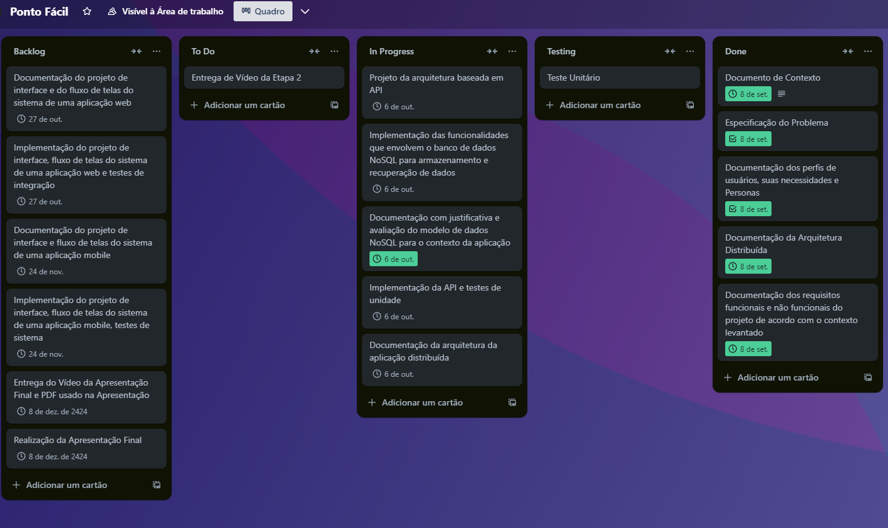

# Metodologia

### Pré-requisitos: Documentação de Especificação

A metodologia de trabalho adotada pelo grupo para o desenvolvimento do *PontoFácil* é baseada em metodologias ágeis, com o objetivo de garantir entregas rápidas e iterativas. O foco está em um processo organizado para o desenvolvimento da aplicação, utilizando as ferramentas adequadas para cada etapa.

### Relação de Ambientes de Trabalho

Os ambientes de desenvolvimento e as plataformas utilizadas pelo grupo estão organizados da seguinte forma:

| Ambiente     | Plataforma       | Link de Acesso                        |
|--------------|------------------|---------------------------------------|
| Desenvolvimento | VS Code, Node.js, MongoDB | [[Link Repositório GitHub](https://github.com/ICEI-PUC-Minas-PMV-ADS/pmv-ads-2023-2-e4-proj-dad-t2-pontofacil)](#) |
| Testes       | Postman, Insomnia     |                                  |

### Controle de Versão

Foi adotado o **Git** como ferramenta de controle de versão, utilizando o **GitHub** para hospedagem e gestão do código-fonte. O fluxo de trabalho segue uma estrutura baseada no Gitflow, com a seguinte convenção de branches:

- **main**: versão estável do software;
- **dev**: versão em desenvolvimento;
- **feature/[nome]**: ramificação para desenvolvimento de novas funcionalidades;
- **bugfix/[nome]**: ramificação para correção de bugs.

Além disso, a gestão de issues é feita por meio de etiquetas no GitHub:

- **documentation**: melhorias ou ajustes na documentação;
- **bug**: indica problemas ou falhas em funcionalidades;
- **enhancement**: melhorias em funcionalidades existentes;
- **feature**: implementação de novas funcionalidades.

A equipe utiliza pull requests para revisar o código antes de realizar merges nas branches principais.

### Divisão de Papéis

A equipe é organizada utilizando **Scrum** como metodologia ágil, distribuindo papéis de acordo com as responsabilidades de cada membro. A divisão de papéis foi feita da seguinte maneira:

- **Scrum Master**: Thiago Pontes Gazzinelli;
- **Product Owner**: Matheus Gonçalves de Oliveira Machado;
- **Equipe de Desenvolvimento**: Matheus Gonçalves de Oliveira Machado , Caio Santos Celestino da Costa, Thiago Pontes Gazzinelli, Carlos Henrique Santos da Silva, Vinicius Henrique Alves Mariano;
- **Equipe de Design**: Vinicius Henrique Alves Mariano.

### Processo

O gerenciamento adequado de tarefas contribuirá para que o projeto alcance altos níveis de produtividade. Por isso, é fundamental que ocorra a gestão de tarefas e de pessoas, de modo que os times envolvidos no projeto possam ser facilmente gerenciados. 
Elementos de Sprint no Trello: https://trello.com/b/vBYTqlFh/ponto-facil

### Ferramentas

A seguir estão as ferramentas empregadas no desenvolvimento do projeto, com suas justificativas:

- **VS Code**: editor de código com integração ao GitHub, facilitando o controle de versão;
- **Node.js** e **Express**: escolhidos pela facilidade em construir o backend da aplicação de forma escalável;
- **MongoDB**: banco de dados NoSQL, ideal para o gerenciamento dinâmico de dados;
- **Postman**: utilizado para testar a API durante o desenvolvimento;
- **Discord, Whatsapp**: ferramenta de comunicação entre os membros do grupo;
- **Figma, Marvel, Astah**: utilizado para criação de diagramas e wireframes.
