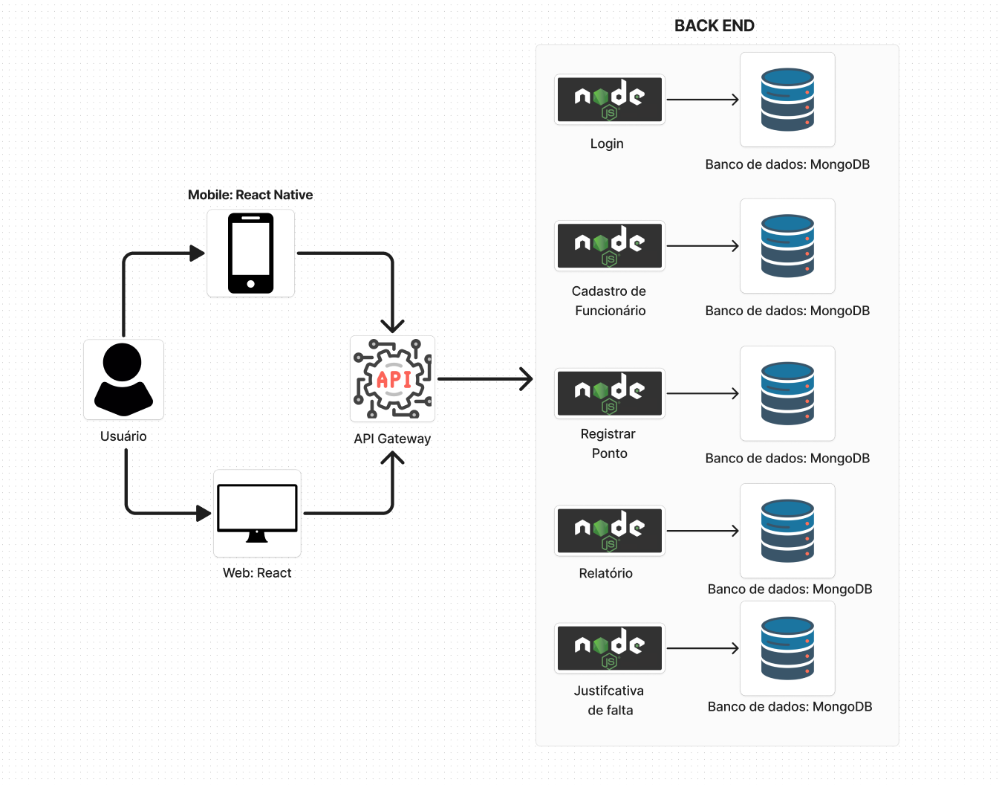
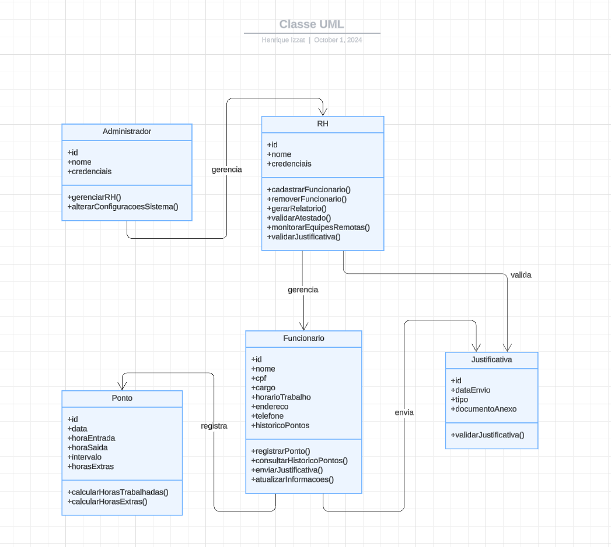

# Arquitetura da Solução

## Arquitetura de Software Distribuída

A arquitetura de software distribuída é um modelo de desenvolvimento onde os componentes do sistema são distribuídos em diferentes servidores ou dispositivos, permitindo que eles funcionem de forma independente e se comuniquem através da rede.



## Diagrama de Classes

O diagrama de classes ilustra graficamente como será a estrutura do software, e como cada uma das classes da sua estrutura estarão interligadas. Essas classes servem de modelo para materializar os objetos que executarão na memória.



## Documentação do Banco de Dados MongoDB

Este documento descreve a estrutura e o esquema do banco de dados não relacional utilizado por nosso projeto, baseado em MongoDB. O MongoDB é um banco de dados NoSQL que armazena dados em documentos JSON (ou BSON, internamente), permitindo uma estrutura flexível e escalável para armazenar e consultar dados.

### Esquema do Banco de Dados


## Coleção: `employees`

Armazena as informações dos funcionários do sistema.

**Estrutura do Documento:**

```json
{
  "_id": "ObjectId('64e1f6b99b7a4567890abc12')",
  "name": "Carlos Silva",
  "email": "carlos.silva@example.com",
  "password": "hash_da_senha",
  "position": "Desenvolvedor",
  "role": "employee",  "admin", "rh", "employee"
  "company": "ObjectId('64e1f6b99b7a4567890abc34')",
  "createdAt": "2024-09-27T10:00:00Z"
}
```
### Descrição dos Campos

- **`_id`**: Identificador único do funcionário gerado automaticamente pelo MongoDB.
- **`name`**: Nome completo do funcionário.
- **`email`**: Endereço de email único do funcionário, utilizado para login.
- **`password`**: Hash da senha do funcionário para autenticação segura.
- **`position`**: Cargo que o funcionário ocupa na empresa (exemplo: Desenvolvedor, Analista, etc.).
- **`role`**: Papel do funcionário no sistema, podendo ser 'admin', 'rh' (Recursos Humanos) ou 'employee' (funcionário comum). O valor padrão é 'employee'.
- **`company`**: Referência ao identificador da empresa associada ao funcionário.
- **`createdAt`**: Data e hora de criação do funcionário, gerada automaticamente.


## Coleção: `absence`

Este documento descreve a estrutura do esquema de ausência utilizado em nosso projeto, baseado no MongoDB.

**Estrutura do Documento:**

```json
{
  "employee": "ObjectId('5f7e1bbf9b2a4f1a9c38b9a1')",
  "company": "ObjectId('5f7e1bbf9b2a4f1a9c38b9a2')",
  "date": "2024-09-27T00:00:00Z",
  "reason": "Motivo da ausência",
  "document": "link_para_documento",
  "status": "pending",
  "createdAt": "2024-09-27T10:00:00Z"
}
```
### Descrição dos Campos

- **`_id`**: Identificador único da ausência gerado automaticamente pelo MongoDB.
- **`employee`**: Referência ao identificador do funcionário que está se ausentando.
- **`company`**: Referência ao identificador da empresa associada à ausência.
- **`date`**: Data da ausência do funcionário.
- **`reason`**: Motivo da ausência, que deve ser fornecido pelo funcionário.
- **`document`**: Link ou referência para um documento que justifique a ausência (opcional).
- **`status`**: Status da solicitação de ausência, podendo ser 'pending', 'approved' ou 'rejected'. O valor padrão é 'pending'.
- **`createdAt`**: Data e hora de criação do registro de ausência, gerada automaticamente.


 ## Coleção: `company`

Este documento descreve a estrutura do esquema de empresa utilizado em nosso projeto, baseado no MongoDB.

**Estrutura do Documento:**

```json
{
  "name": "Nome da Empresa",
  "admin": "ObjectId('5f7e1bbf9b2a4f1a9c38b9a1')",
  "createdAt": "2024-09-27T10:00:00Z"
}
```
### Descrição dos Campos

- **`_id`**: Identificador único da empresa gerado automaticamente pelo MongoDB.
- **`name`**: Nome da empresa, que é um campo obrigatório.
- **`admin`**: Referência ao identificador do funcionário que é o administrador da empresa. Este campo é obrigatório.
- **`createdAt`**: Data e hora de criação do registro da empresa, gerada automaticamente.


## Coleção: `timeEntry`

Este documento descreve a estrutura do esquema de entradas de ponto utilizado em nosso projeto, baseado no MongoDB.

**Estrutura do Documento:**

```json
{
  "employee": "ObjectId('5f7e1bbf9b2a4f1a9c38b9a1')",
  "company": "ObjectId('5f7e1ccf9b2a4f1a9c38b9a2')",
  "type": "in",
  "timestamp": "2024-09-27T10:00:00Z"
}
```
### Descrição dos Campos

- **`_id`**: Identificador único da entrada de ponto gerado automaticamente pelo MongoDB.
- **`employee`**: Referência ao identificador do funcionário que está registrando a entrada ou saída de ponto. Este campo é obrigatório.
- **`company`**: Referência ao identificador da empresa associada à entrada de ponto. Este campo é obrigatório.
- **`type`**: Tipo da entrada, que pode ser 'in' (entrada) ou 'out' (saída). Este campo é obrigatório.
- **`timestamp`**: Data e hora em que a entrada de ponto foi registrada, com valor padrão gerado automaticamente.


  


### Boas Práticas

Validação de Dados: Implementar validação de esquema e restrições na aplicação para garantir a consistência dos dados.

Monitoramento e Logs: Utilize ferramentas de monitoramento e logging para acompanhar a saúde do banco de dados e diagnosticar problemas.

Escalabilidade: Considere estratégias de sharding e replicação para lidar com crescimento do banco de dados e alta disponibilidade.

### Material de Apoio da Etapa

Na etapa 2, em máterial de apoio, estão disponíveis vídeos com a configuração do mongo.db e a utilização com Bson no C#


## Modelo ER (Somente se tiver mais de um banco e outro for relacional)

O Modelo ER representa através de um diagrama como as entidades (coisas, objetos) se relacionam entre si na aplicação interativa.

As referências abaixo irão auxiliá-lo na geração do artefato “Modelo ER”.

> - [Como fazer um diagrama entidade relacionamento | Lucidchart](https://www.lucidchart.com/pages/pt/como-fazer-um-diagrama-entidade-relacionamento)

## Esquema Relacional (Somente se tiver mais de um banco e outro for relacional)

O Esquema Relacional corresponde à representação dos dados em tabelas juntamente com as restrições de integridade e chave primária.
 
As referências abaixo irão auxiliá-lo na geração do artefato “Esquema Relacional”.

> - [Criando um modelo relacional - Documentação da IBM](https://www.ibm.com/docs/pt-br/cognos-analytics/10.2.2?topic=designer-creating-relational-model)

## Modelo Físico (Somente se tiver mais de um banco e outro for relacional)

Entregar um arquivo banco.sql contendo os scripts de criação das tabelas do banco de dados. Este arquivo deverá ser incluído dentro da pasta src\bd.

## Tecnologias Utilizadas

A seguir estão as tecnologias utilizadas ate o momento no desenvolvimento do projeto, com suas justificativas:

- **Node.js** e **Express**: escolhidos pela facilidade em construir o backend da aplicação de forma escalável;
- **MongoDB**: banco de dados NoSQL, ideal para o gerenciamento dinâmico de dados;


## Hospedagem

Explique como a hospedagem e o lançamento da plataforma foi feita.

> **Links Úteis**:
>
> - [Website com GitHub Pages](https://pages.github.com/)
> - [Programação colaborativa com Repl.it](https://repl.it/)
> - [Getting Started with Heroku](https://devcenter.heroku.com/start)
> - [Publicando Seu Site No Heroku](http://pythonclub.com.br/publicando-seu-hello-world-no-heroku.html)

## Qualidade de Software

A equipe adotou a ISO/IEC 25010 para nortear o processo de qualidade, focando nas seguintes subcaracterísticas:

- **Funcionalidade**: Garantir que o sistema atenda corretamente aos requisitos de controle de ponto.
- **Usabilidade**: Interface amigável para facilitar o uso por funcionários e RH.
- **Confiabilidade**: Minimizar bugs e falhas nos registros de ponto.


